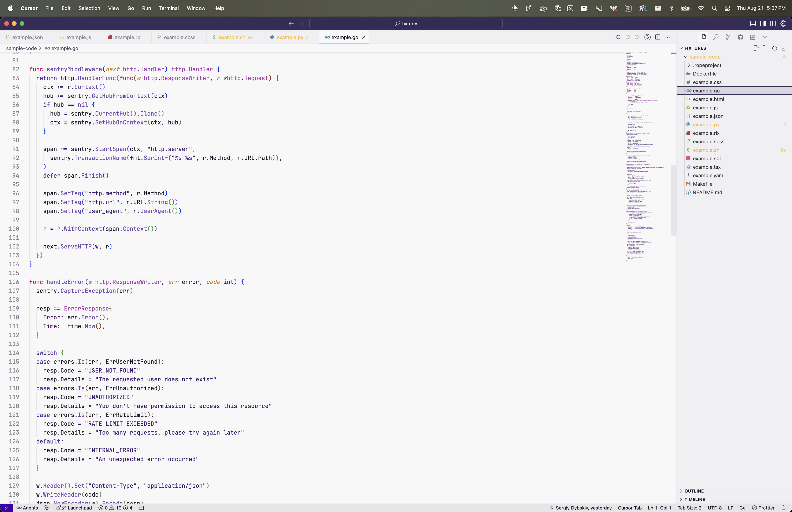
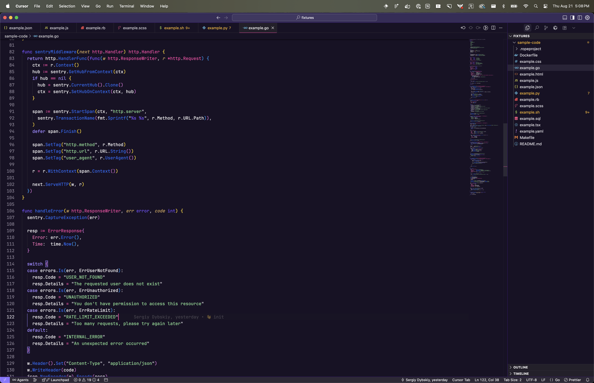
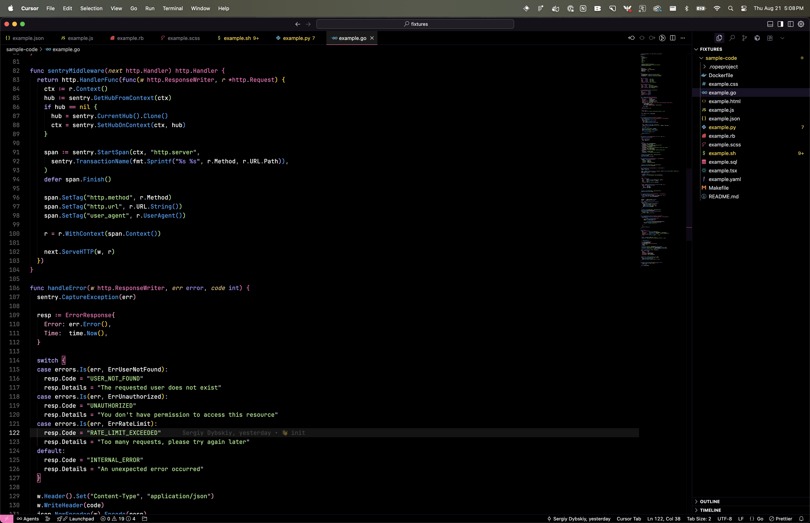
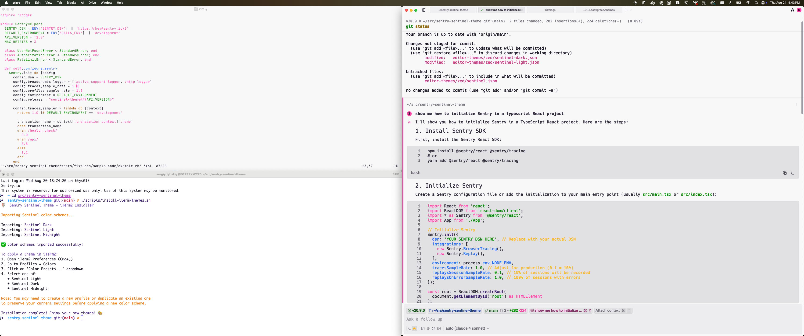
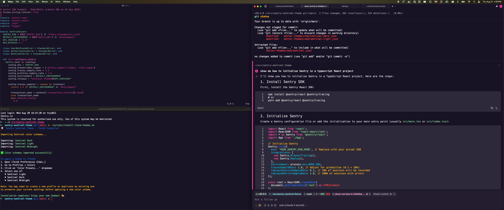
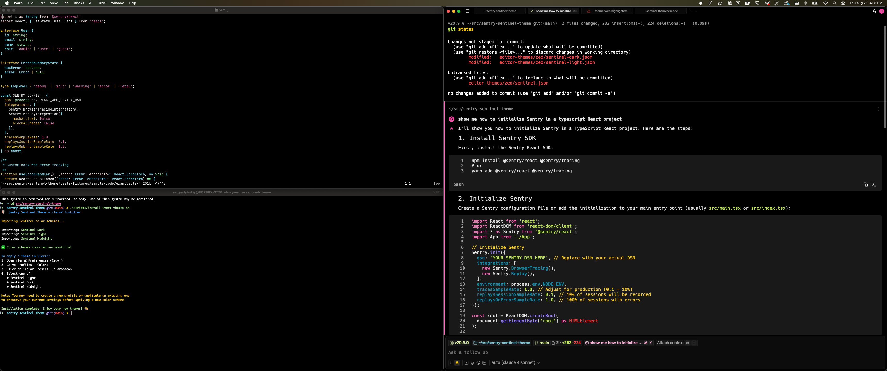
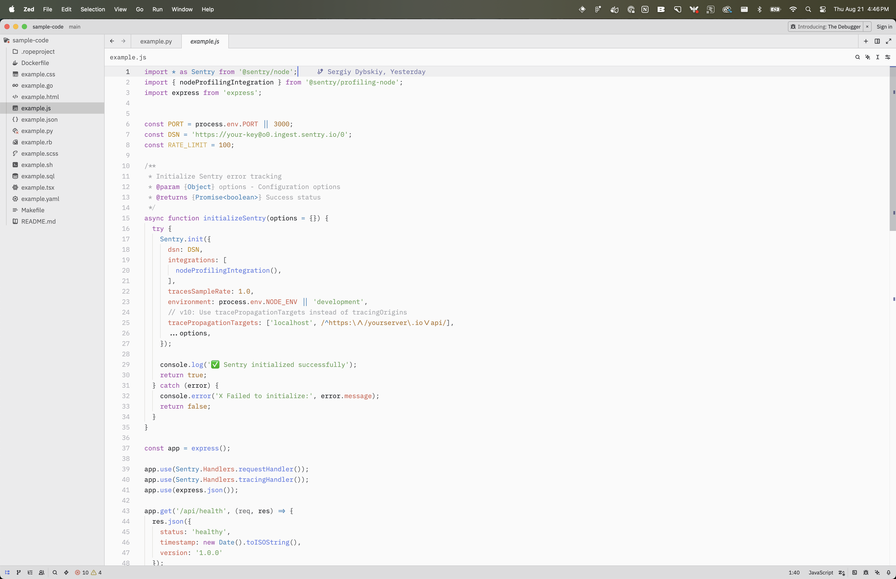
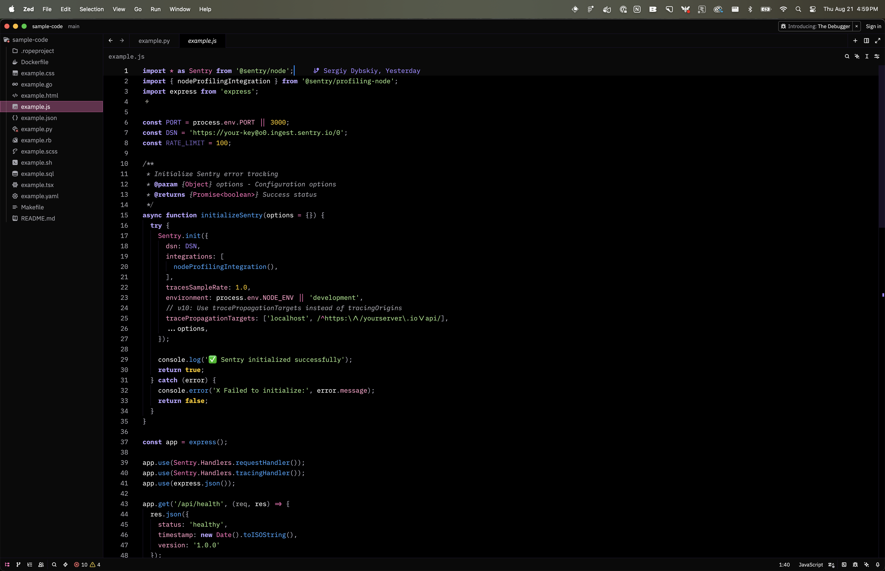

# 🛡️ Sentry Sentinel Theme

> Beautiful, accessible developer themes inspired by Sentry's brand colors

A comprehensive theme collection bringing Sentry's distinctive purple and pink brand colors to your favorite development tools. Designed with WCAG AA accessibility standards and developer ergonomics in mind.

## ✨ Features

- 🎨 **Official Sentry Colors** - Based on authentic brand guidelines
- ♿ **WCAG AA Compliant** - All themes meet or exceed accessibility standards
- 🌓 **Three Variants** - Light, Dark, and Midnight themes
- 🚀 **Multi-Platform** - VS Code, terminals, web syntax highlighters
- 🔍 **Semantic Highlighting** - Consistent token colors across all platforms

## 🚀 Quick Install

### VS Code / Cursor
```bash
# From VS Code Marketplace
ext install sentry.sentinel-theme

# Or search "Sentry Sentinel Theme" in Extensions
```

### Editors & Terminal Emulators
```bash
# Quick install scripts
./scripts/install-zed-themes.sh      # Zed editor
./scripts/install-iterm-themes.sh    # iTerm2
./scripts/install-ghostty-themes.sh  # Ghostty
./scripts/install-warp-themes.sh     # Warp

# Or see detailed instructions
cat docs/INSTALL.md
```

## 🎨 Theme Variants

| Variant | Background | Best For |
|---------|------------|----------|
| **Sentinel Light** |  `#FFFFFF` | Daytime coding, bright environments |
| **Sentinel Dark** |  `#181225` | Standard dark theme preference |
| **Sentinel Midnight** |  `#000000` | OLED displays, ultra-dark environments |

All variants feature:
- ✅ WCAG AA compliant contrast ratios
- 🎯 Semantic token highlighting
- 💜 Sentry brand color integration
- 🔍 Clear visual hierarchy

## 📸 Screenshots

### VS Code / Cursor
| Light | Dark | Midnight |
|-------|------|----------|
|  |  |  |

### Terminal
| Light | Dark | Midnight |
|-------|------|----------|
|  |  |  |

### Zed Editor
| Light | Dark | Midnight |
|-------|------|----------|
|  |  |  |

### Web Syntax Highlighters
Try the interactive demo: [Open Demo →](https://sentinel.sentry.dev)

## 🏗️ Supported Platforms

### Editors & IDEs
- Visual Studio Code
- Cursor
- Zed
- Vim / Neovim

### Terminal Emulators  
- Ghostty
- Warp
- iTerm2
- Terminal.app
- Windows Terminal

### Web Syntax Highlighters
- Prism.js
- Highlight.js

## 🎯 Color System

Our themes use a carefully crafted palette based on Sentry's brand colors:

| Token | Light | Dark | Midnight |
|-------|-------|------|----------|
| **Keywords** |  `#4E2A9A` |  `#9E86FF` |  `#B8A5FF` |
| **Strings** |  `#36166B` |  `#83DA90` |  `#A5E68A` |
| **Functions** |  `#6E47AE` |  `#226DFC` |  `#3EA6FF` |
| **Types/Classes** |  `#A737B4` |  `#FF45A8` |  `#FF70BC` |
| **Numbers** |  `#EE8019` |  `#FDB81B` |  `#FFCC00` |
| **Comments** |  `#898294` |  `#898294` |  `#A8A8B0` |

## ♿ Accessibility 

All themes meet **WCAG 2.1 AA** standards:
- ✅ Minimum 4.5:1 contrast ratio for normal text
- ✅ Minimum 3:1 contrast ratio for large text  
- ✅ Tested contrast ratios for all token colors
- ✅ Color-blind friendly palette

Tested combinations:
- Light: 18.2:1 background/foreground ratio
- Dark: 17.2:1 background/foreground ratio  
- Midnight: 21:1 background/foreground ratio

## 📁 Project Structure

```
sentry-sentinel-theme/
├── colors.json              # Master color definitions
├── vscode/                  # VS Code extension
├── editor-themes/           # Editor themes (Zed, etc.)
├── terminal-themes/         # Terminal emulator themes
├── web-highlighters/        # Prism.js & Highlight.js
├── tests/                   # Color validation tests
├── docs/                    # Documentation
└── scripts/                 # Installation helpers
```

## 🧪 Testing

```bash
# Run contrast ratio tests
npm run test:contrast

# Validate color consistency
npm run test:colors

# Preview themes in browser
open web-highlighters/index.html
```

## 🤝 Contributing

We welcome contributions! Please see [CONTRIBUTING.md](docs/CONTRIBUTING.md) for guidelines.

### Development Setup

```bash
# Clone repository
git clone https://github.com/getsentry/sentinel.git
cd sentinel

# Install dependencies
npm install

# Run tests
npm test
```

## 📄 License

MIT License - see [LICENSE](LICENSE) for details.

## 🔗 Links

- [VS Code Marketplace](https://marketplace.visualstudio.com/items?itemName=sentry.sentinel-theme)
- [GitHub Repository](https://github.com/getsentry/sentinel)
- [Report Issues](https://github.com/getsentry/sentinel/issues)
- [Sentry.io](https://sentry.io)

---

Made with 💜 and 🤖s by [@sergical](https://github.com/sergical) for Sentry Hackweek 2025
